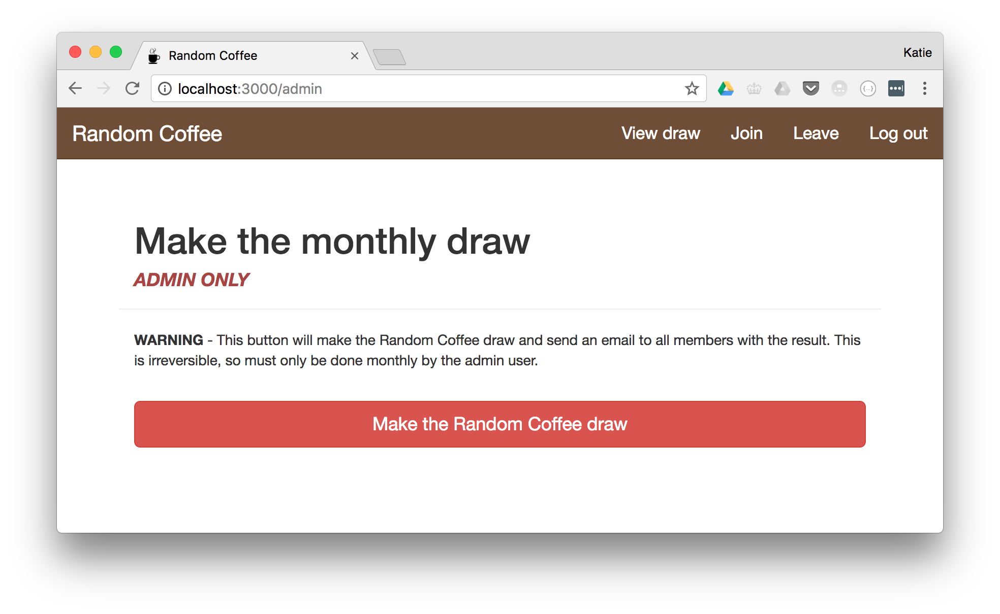

# Random Coffee

A prototype Rails app for pairing up people randomly to meet for coffee. The app requires authentication with Google and sends email notifications to users.

## Getting started

The app uses Google for authentication - you'll need a client ID and client secret from the [Google API console](https://console.developers.google.com) which are set up to access email addresses and basic profile info.

### Environment variables you will need
* `GOOGLE_CLIENT_ID` and `GOOGLE_CLIENT_SECRET` - see above
* `EMAIL_SENDER` - the emails sent from the app will appear to come from this variable.
* `ALLOWED_HOST_DOMAIN` - the Google email address ending(s) that are allowed to log in. More details [here](https://github.com/zquestz/omniauth-google-oauth2/blob/master/README.md).
* `SENDGRID_PASSWORD` and `SENDGRID_USERNAME` - needed to send emails in production. Using Heroku with Sendgrid as an add-on should automatically create these environment variables.

### Running the application
```
bundle exec rails s
```

### Running the test suite
```
bundle exec rake
```

## Screenshots



